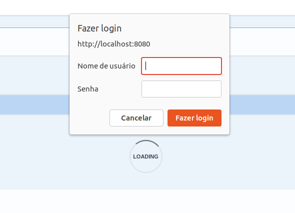

# tech-challenge

# Iniciar a aplicação pelo docker
## Acesse a pasta do docker
```sh
cd docker
```
## Rode o comando abaixo para buildar e subir a aplicação
```sh
 docker-compose up --build
```

## Rode o comando abaixo para subir a aplicação e o banco
```sh
 docker-compose up
```

# Testar a aplicação

**OBS: Os endpoints que não possuem ação do cliente precisam de autenticação, use o usuário padrão para mandar as requests:**
- email: test@test.com
- senha: senha123


## Acesse o swagger
Abra o navegador e cole a url: http://localhost:8080/swagger-ui/index.html

## Cadastro

- Abra o enpoint POST - /clientes
- Coloque as informações descritas no payload e envie a request

## Pedido
- Acesse o endpoint de GET - /produtos/porCategoria para filtrar os produtos por categoria
- Acesse o endpoint de produtos GET - /produtos para verificar e escolher os produtos a serem adicionados ao pedido
- Acesse o endpoint de pedido POST - /pedidos e informe os itens que deseja adicionar especificando o id do produto desejado

## Pagamento
- Acesse o enpoint de pagamento POST - /pagamentos e envia a request

## Fila de pedidos cozinha
- Acesse o enpoint de pedidos GET - /pedidos/fila e envia a request (Usar usuário padrão)

## Atualizar status do pedido (Cozinha)
- Status: EM_PREPARACAO / PRONTO / FINALIZADO
- Acesse o enpoint de pedidos GET - /pedidos/{pedidoId}/status e envia a request com o status desejado.

## Consultar status do pedido (Cliente)
- Acesse o enpoint de pedidos GET - /pedidos/{pedidoId} e envia a request.

## Mercado pago
### Fluxo de pagamento
- Execute o comando `kubectl port-forward svc/tech-challenge-service 8080:80`
- Acesse o mercado pago com essa conta de teste:
```
usuario: TESTUSER2094400829
senha: T5QXrnlKgJ
```
- Faça um pedido no endpoint `POST - /pedido`
- Com o id do pedido execute uma chamada para o enpoint `/pagamentos/mercado-pago/qrcode`
- Pegue o QR Code em formato de texto que será retornado e cole nesse [site](https://www.qrcode-monkey.com/pt/?utm_source=google_c&utm_medium=cpc&utm_campaign=&utm_content=&utm_term=qrcode%20monkey_e&gclid=CjwKCAjw3dCnBhBCEiwAVvLcuzrWOjjWvrrH2V7GILt-d04D3pUgkeBTYBYvMzAmLMmNs2ZjzphfwBoC-rEQAvD_BwE#text) aperte o botão "Criar QR Code"

#### Fluxo de pagamento com sucesso
- escaneie o QR Code e efetue o pagamento saldo da conta

#### Fluxo de pagamento com erro
- escaneie o QR Code e efetue o pagamento o cartão de crédoto cadastrado.
